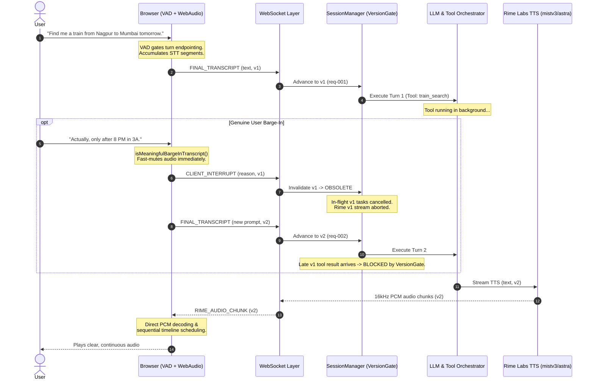

# VoiceFlow

VoiceFlow is an interruption-safe realtime voice agent designed for multi-step reasoning, background tool execution, and responsive voice interaction.

---

## Target Problem: Interruption-Safe Realtime Voice

In traditional voice agents, when a user interrupts while the agent is speaking or executing a long-running tool, common failure modes emerge:
- **Audio Overlap & Delayed Interruption**: The agent keeps speaking stale output after the user has begun a new request.
- **Race Conditions & Stale Leaks**: A background tool from an earlier turn completes late and injects outdated data into the conversation state or triggers obsolete TTS playback.
- **Premature Interruption on Noise**: Single-character STT tokens or ambient microphone noise during thinking states cancel valid requests prematurely.
- **PCM Playback Bursts**: Audio chunks streaming over WebSocket are started concurrently without timeline scheduling, causing garbled bursts.

VoiceFlow solves these challenges with **VAD-gated turn endpointing**, **deterministic monotonic request versioning**, **three-level stale audio protection**, and **sequential PCM playback queuing**, powered by **Rime Labs TTS**.

---

## Core Architecture & Realtime Event Flow



---

## Key Capabilities

1. **Deterministic Request Versioning**: Monotonic `conversation_version` paired with UUID `request_id` ensures every request, tool execution, and audio chunk is strictly bound to its issuing context.
2. **Three-Level Stale Audio Protection**:
   - **Level 1 (Stream Gate)**: Aborts in-flight HTTP connections to Rime immediately upon cancellation.
   - **Level 2 (Buffer Gate)**: Purges queued audio chunks if the active conversation version advances.
   - **Level 3 (Playback Gate)**: Rejects obsolete audio frames at the WebAudio playback boundary.
3. **Barge-In Qualification**: Gated filtering (`isMeaningfulBargeInTranscript`) distinguishes between natural user phrases ("actually", "wait", "only after 8 PM") and spurious single-character recognitions or filler artifacts ("a", "um", "uh") during processing states.
4. **Sequential PCM Playback Queue**: Directly decodes raw 16-bit signed LE PCM from Rime at 16000 Hz, scheduling chunks contiguously along the WebAudio timeline without bursts or gaps.
5. **Strict Tool Registry & Version Gate**: Whitelists callable tools (`train_search`) and validates returns before state mutation. Stale tool results from superseded turns are rejected cleanly.

---

## Primary TTS Provider: Rime Labs

VoiceFlow uses Rime Labs as its primary and exclusive TTS provider for all spoken responses.

### Verified Rime Configuration

| Parameter | Value | Description |
| :--- | :--- | :--- |
| **Endpoint** | `https://users.rime.ai/v1/rime-tts` | Direct HTTP streaming endpoint |
| **Model** | `mistv3` | Production low-latency expressive model |
| **Speaker** | `astra` | Default conversational voice |
| **Language** | `eng` | English language code |
| **Audio Format** | `pcm` | Raw 16-bit linear PCM |
| **Sample Rate** | `16000` | 16 kHz mono audio |
| **Transport** | `HTTP streaming` | Chunked transfer streaming to WebSocket |

---

## Configuration Hygiene & Security

- **API Keys**: All API keys (`RIME_API_KEY`, `OPENAI_API_KEY`) are managed exclusively on the backend via environment variables and are **never exposed to the browser client or committed to source control**.
- **Template**: `.env.example` contains safe placeholders for development setup.
- **Offline Fallback**: VoiceFlow includes 100% deterministic offline mocks for LLM and TTS testing without external network dependencies.

---

## Setup & Quickstart

### Prerequisites
- **Python**: 3.10 or higher
- **Node.js**: 18 or higher (with npm)

### 1. Backend Setup

```bash
# Navigate to backend directory
cd backend

# Create and activate virtual environment
python -m venv .venv

# On Windows PowerShell:
.\.venv\Scripts\Activate.ps1
# On Linux / macOS:
# source .venv/bin/activate

# Install dependencies
pip install -r requirements.txt

# Configure environment variables
cp ../.env.example .env
# Edit .env and supply your RIME_API_KEY (and optionally OPENAI_API_KEY)
```

### 2. Frontend Setup

```bash
# Navigate to frontend directory
cd frontend

# Install Node dependencies
npm install
```

### 3. Running the Application

**Start the Backend (Port 8000):**
```bash
# From backend directory with venv activated:
uvicorn app.main:app --reload --port 8000
```

**Start the Frontend (Port 5173):**
```bash
# From frontend directory:
npm run dev
```

Open `http://localhost:5173` in Google Chrome or Microsoft Edge to open the VoiceFlow developer dashboard.

---

## Verification & Test Suite

VoiceFlow includes an extensive, fully automated test suite:

### 1. Pytest Unit & Integration Tests (108 Tests)
```bash
.\backend\.venv\Scripts\pytest tests -v
```
*Result: 108 passed across state versioning, Rime streaming, barge-in qualification, and PCM queue sequencing.*

### 2. Voice Interruption Smoke Test
```bash
.\backend\.venv\Scripts\python backend/scripts/voice_interruption_smoke_test.py
```
*Result: 6/6 checks passed (Rime configuration, multi-segment coalescing, barge-in during tool execution, ambient noise immunity, stale result rejection).*

### 3. Real Browser E2E Test (CDP Automated Chrome)
```bash
.\backend\.venv\Scripts\python backend/scripts/browser_e2e_test.py
```
*Result: 8/8 checks passed with full screenshot and audio telemetry capture.*

### 4. Frontend Production Build
```bash
cd frontend && npm run build
```
*Result: TypeScript compilation and Vite bundle build passed with 0 errors.*

---

## Known Browser & Hardware Considerations

1. **Browser Speech Recognition**: VoiceFlow relies on the browser's `webkitSpeechRecognition` / `SpeechRecognition` interface. For optimal experience, use **Google Chrome** or **Microsoft Edge**.
2. **Acoustic Environment**: Laptop built-in speakers without hardware acoustic echo cancellation can feed audio back into the microphone. Using **earphones or a headset** is recommended for real-microphone testing to avoid acoustic feedback.

